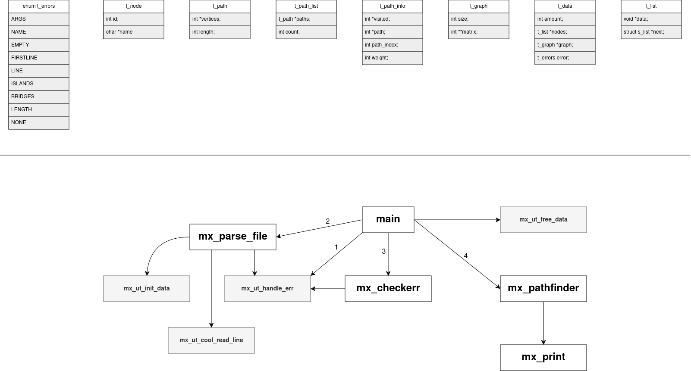

# UCODE-PATHFINDER
## Observer's assessment - 100/100
The Pathfinder program is designed to find the shortest paths between all combinations of islands using information 
from a file that describes the bridges connecting them. 
The goal is to automate the calculation of optimal paths in scenarios where efficient time and resource use is necessary,
such as navigation, logistics, and network routing.

---

## Functionality and Features

- **Input**: The program reads data from a file specified as a command-line argument.
  The file contains the number of islands and descriptions of bridges connecting the islands with corresponding distances.


- **Output**: The program prints the shortest paths between each pair of islands, 
  formatted with path details, routes, and total distances.


- **Error Handling**: The program checks for a variety of possible errors, such as invalid file format, 
  missing or empty files, duplicate bridges, and exceeding bridge length limits.

## Program Usage

```bash
make
```
```bash
./pathfinder [filename]
```

## Project Structure

1. **Root Directory**
    Contains the `Makefile` and a directory structure for organizing code, headers, and object files. 
2. `src/` Directory
    Contains the `.c` source files for the program. This directory should contain the main logic for reading the file,
    processing the data, and calculating the shortest paths using graph algorithms.
3. `inc/` Directory
    Contains the header file `pathfinder.h`, which declares the structures, 
    constants, and function prototypes used throughout the program. 
4. `libmx/` Directory
    Contains the source files for the custom library `libmx`, including its Makefile. 
    This library contains auxiliary functions, for string handling, memory management, and other utilities. 
5. `obj/` Directory
    The object files `.o` will be generated during the compilation process. 
    This directory is created by the Makefile and should not be included in the repository.
6. `pathfinder` executable file will be generated during the compilation process.
   This file is created by the Makefile and should not be included in the repository.



## Input File Format

    First line: the number of islands.
    Subsequent lines: bridge descriptions, 
    including two island names and the distance between them.

### Example
```
4
IslandA-IslandB,5
IslandB-IslandC,10
IslandC-IslandD,3
IslandA-IslandD,12
```

## Output Format

The output consists of formatted blocks that display:

    The path between islands.
    The full route of islands.
    The distance between each island and the total distance.

### Example
```
========================================
Path: IslandA -> IslandD
Route: IslandA -> IslandB -> IslandC -> IslandD
Distance: 5 + 10 + 3 = 18
========================================
```

## Error Handling

* Incorrect number of command-line arguments: `usage: ./pathfinder [filename]`

* File does not exist: error: `file [filename] does not exist`

* File is empty: error: `file [filename] is empty`

* Invalid format or data in the file, such as:
  * `error: line [line_number] is not valid`
  * `error: invalid number of islands`
  * `error: duplicate bridges`
  * `error: sum of bridges lengths is too big`
